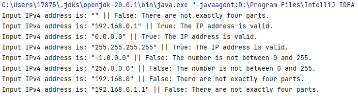
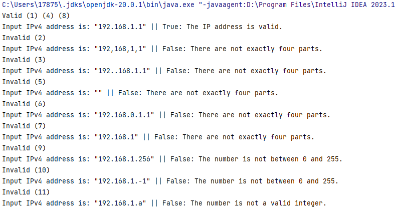
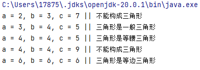
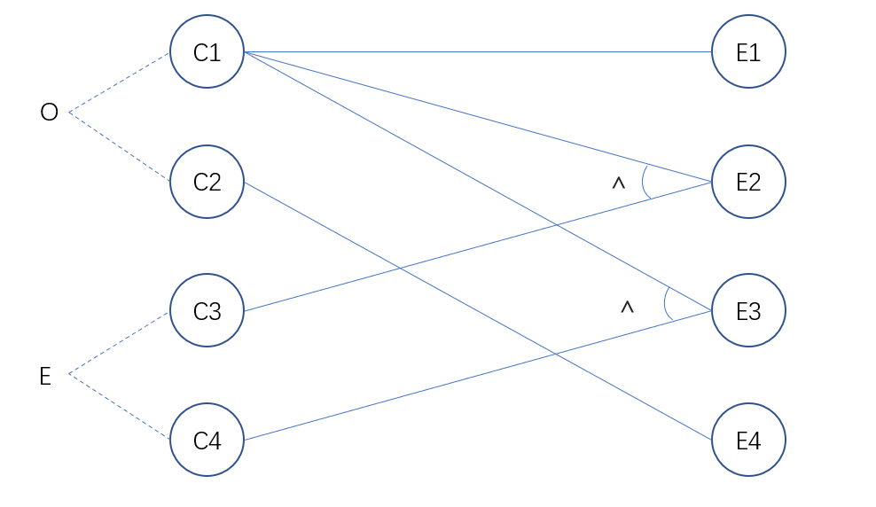
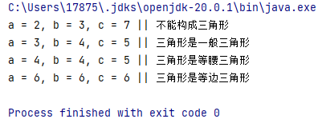

# 山东大学软件学院软件测试课程实验报告

## 一、前言

### 1.1 个人信息

- 学号：
- 姓名：
- 班级：

### 1.2 实验基本信息

本次实验报告是山东大学软件学院软件测试课程第一次实验——“黑盒测试”的实验报告。

本次实验代码已开源至 GitHub，链接为：https://github.com/cyz020403/Software-Testing-Lab。

#### 1.2.1 实验题目

实验题目为“黑盒测试”，具体分为两个问题：

1. 有效 IP 地址：判断一串输入的字符串是否为有效的 IPv4 地址。
2. 三角形判断：有一个程序读入 3 个整数，把这 3 个整数作为一个三角形的 3 条边的长度值。这个程序要打印出信息，说明这 3 个整数是否能组成三角形，如果能组成三角形，说明这个三角形是不等边、等腰或等边三角形。

#### 1.2.2 实验学时

4学时。

#### 1.2.3 实验日期

2023/4/10。

#### 1.2.4 实验目的

设计测试用例，每题选择使用两种合适的黑盒测试方法展开测试。

1. 利用边界值分析法展开测试。
2. 在等价类划分方式下设计测试用例展开测试
3. 利用判定表法展开测试。
4. 利用因果图法展开测试。

本实验要求撰写详细的实验报告。

### 1.3 实验环境

#### 1.3.1 硬件环境

- PC：Dell Precision 3640 Tower
- CPU：lntel(R) Core(TM) i9-10900K CPU @ 3.70 GHz
- 内存：64 G
- 磁盘：Micron 2300 NVMe 1024 GB（SSD）
- GPU：NVIDIA GeForce RTX 3090

#### 1.3.2 软件环境

- Windows 11 22H2
- IntelliJ IDEA
- OpenJDK 20.0.1

## 二、实验步骤与内容

### 2.1 有效 IPv4 地址检验

#### 2.1.1 问题重述

本部分的内容是“实验题目”中的第一道题目，即：“有效 IP 地址：判断一串输入的字符串是否为有效的 IPv4 地址”。

根据实验要求，本题目选择前两种方式即“边界值分析法”和“等价类划分法”进行测试。

#### 2.1.2 IPv4 地址读入

在进行测试之前，我们需要实现一个完善的读入 IPv4 地址的代码，并对当前读入的内容是否已经是合法的 IPv4 地址进行判断，并进行合适的输出，以便于之后对 此部分代码进行测试。

代码的主要思想是将 IPv4 地址字符串拆分成四个部分，并验证每个部分是否是一个介于0和255之间的整数。如果所有部分都有效，则返回 `true`，否则返回 `false`。

**代码实现思路**

1. 定义一个公共类 `ReadIPv4Address`，其中包含一个公共静态方法 `isValidIPv4Address`。
2. 该方法接受一个类型为 `String` 的参数，该参数表示要验证的 IPv4 地址。
3. 方法首先将 IPv4 地址字符串拆分成四个部分，即四个十进制数，存储在一个字符串数组中。
4. 方法检查数组的长度是否为4，如果不是，说明输入的 IPv4 地址不符合标准格式，直接返回 `false`。
5. 方法遍历每个部分，并尝试将其转换为整数。
6. 如果任何一个部分不能被正确转换为整数，说明输入的 IPv4 地址不符合标准格式，直接返回 `false`。
7. 如果任何一个部分的值不在0到255之间，说明输入的 IPv4 地址不符合标准格式，直接返回 `false`。
8. 如果程序执行到这一步，说明输入的 IPv4 地址是有效的，返回 `true`。
9. 方法还会在控制台输出验证结果，包括输入的 IPv4 地址和验证结果。如果是有效的地址，它将返回 `true` 并在控制台输出 "True: The IP address is valid."；如果不是，则返回 `false` 并在控制台输出相应的错误消息。

**代码实现**

``` java
package main;

public class ReadIPv4Address {
    public static boolean isValidIPv4Address(String ip) {
        // Split the IP address into its four decimal parts.
        String[] parts = ip.split("\\.");

        // Check that there are exactly four parts.
        if (parts.length != 4) {
            System.out.println("Input IPv4 address is: \"" + ip + "\" " + "|| False: There are not exactly four parts.");
            return false;
        }

        // Check that each part is a valid integer between 0 and 255.
        for (String part : parts) {
            try {
                int num = Integer.parseInt(part);
                if (num < 0 || num > 255) {
                    System.out.println("Input IPv4 address is: \"" + ip + "\" " + "|| False: The number is not between 0 and 255.");
                    return false;
                }
            } catch (NumberFormatException e) {
                System.out.println("Input IPv4 address is: \"" + ip + "\" " + "|| False: The number is not a valid integer.");
                return false;
            }
        }

        // If we got this far, the IP address is valid.
        System.out.println("Input IPv4 address is: \"" + ip + "\" " + "|| True: The IP address is valid.");
        return true;
    }
}
```

#### 2.1.3 边界值分析测试

完成 IPv4 地址读入的代码编写之后，我们接下来希望对代码进行边界值分析法测试。

需要考虑的边界值有：

- 输入内容边界，即是否输入内容。
- 允许的输入字符边界。
- 允许的数字范围边界。
- 允许的数字个数边界。

**测试用例**

根据 IPv4 地址的边界值以及上文代码，我设计的测试用例如下：

- 测试用例 1：输入字符串为空。 期望输出：false。
- 测试用例 2：输入字符串中的每个数字都在0和255之间。 期望输出：true。具体测试用例：192.168.0.1。
- 测试用例 3：输入字符串中的每个数字都等于0。 期望输出：true。具体测试用例：0.0.0.0。
- 测试用例 4：输入字符串中的每个数字都等于255。 期望输出：true。具体测试用例：255.255.255.255。
- 测试用例 5：输入字符串中的每个数字小于0。 期望输出：false。具体测试用例：-1.0.0.0。
- 测试用例 6：输入字符串中的每个数字大于255。 期望输出：false。具体测试用例：256.0.0.0。
- 测试用例 7：输入字符串中只有3个数字，缺少一个数字。 期望输出：false。具体测试用例：192.168.0。
- 测试用例 8：输入字符串中有5个数字，多出一个数字。 期望输出：false。具体测试用例：192.168.0.1.1。

**代码实现思路**

使用 JUnit 测试类，测试 `ReadIPv4Address` 类中 `isValidIPv4Address()` 方法的边界条件。

1. 导入必要的类和方法，包括 `ReadIPv4Address` 类和 `org.junit` 测试框架。
2. 创建一个名为 `BoundaryTest` 的测试类，并使用 `@Test` 注解来标记要运行的测试方法。
3. `testEmptyInput()` 方法测试空输入字符串，期望返回 `false`。
4. `testValidIPv4Address()` 方法测试有效的 IPv4 地址，期望返回 `true`。
5. `testAllZerosIPv4Address()` 方法测试所有零的 IPv4 地址，期望返回 `true`。
6. `testAllOnesIPv4Address()` 方法测试所有255的 IPv4 地址，期望返回 `true`。
7. `testNegativeNumbersIPv4Address()` 方法测试包含负数的 IPv4 地址，期望返回 `false`。
8. `testNumbersGreaterThan255IPv4Address()` 方法测试包含大于255的数字的 IPv4 地址，期望返回 `false`。
9. `testMissingNumberIPv4Address()` 方法测试缺少一个数字的 IPv4 地址，期望返回 `false`。
10. `testExtraNumberIPv4Address()` 方法测试有一个额外数字的 IPv4 地址，期望返回 `false`。
11. `main()` 方法调用上述测试方法来执行测试，并打印出测试结果。

通过运行这些测试方法，可以测试 `isValidIPv4Address()` 方法是否符合预期行为，并在控制台输出测试结果。这些测试方法涵盖了 `isValidIPv4Address()` 方法可能遇到的各种情况，以确保该方法能够正确地处理边界条件。

**代码实现**

```java
package test.ReadIPv4AddressTest;
import org.junit.Test;
import static org.junit.Assert.*;
import main.ReadIPv4Address;

public class BoundaryTest {
    @Test
    public void testEmptyInput() {
        assertFalse(ReadIPv4Address.isValidIPv4Address(""));
    }

    @Test
    public void testValidIPv4Address() {
        assertTrue(ReadIPv4Address.isValidIPv4Address("192.168.0.1"));
    }

    @Test
    public void testAllZerosIPv4Address() {
        assertTrue(ReadIPv4Address.isValidIPv4Address("0.0.0.0"));
    }

    @Test
    public void testAllOnesIPv4Address() {
        assertTrue(ReadIPv4Address.isValidIPv4Address("255.255.255.255"));
    }

    @Test
    public void testNegativeNumbersIPv4Address() {
        assertFalse(ReadIPv4Address.isValidIPv4Address("-1.0.0.0"));
    }

    @Test
    public void testNumbersGreaterThan255IPv4Address() {
        assertFalse(ReadIPv4Address.isValidIPv4Address("256.0.0.0"));
    }

    @Test
    public void testMissingNumberIPv4Address() {
        assertFalse(ReadIPv4Address.isValidIPv4Address("192.168.0"));
    }

    @Test
    public void testExtraNumberIPv4Address() {
        assertFalse(ReadIPv4Address.isValidIPv4Address("192.168.0.1.1"));
    }

    @Test
    public static void main(String[] args) {
        BoundaryTest boundaryTest = new BoundaryTest();
        boundaryTest.testEmptyInput();
        boundaryTest.testValidIPv4Address();
        boundaryTest.testAllZerosIPv4Address();
        boundaryTest.testAllOnesIPv4Address();
        boundaryTest.testNegativeNumbersIPv4Address();
        boundaryTest.testNumbersGreaterThan255IPv4Address();
        boundaryTest.testMissingNumberIPv4Address();
        boundaryTest.testExtraNumberIPv4Address();
    }
}
```

**测试结果**

测试的输出结果截图如下：



这部分内容均来自 `isValidIPv4Address` 方法中的输出，`BoundaryTest` 测试类中的 `assertTrue` 以及 `assertFalse` 均无报错，可见测试数据设计合理，且都能被正确判断。

#### 2.1.4 等价类划分法测试

这部分使用等价类法进行测试。

考虑的等价类有：

- 划分方式
- 划分部分数量
- 各部分数字范围

**等价类表**

| 输入条件                    | 有效等价类                              | 无效等价类                                                   |
| :-------------------------- | --------------------------------------- | ------------------------------------------------------------ |
| 划分方式 | （1）使用一个“.”符号划分 | （2）使用非“.”符号划分（3）使用多于一个“.”符号划分 |
| 划分部分数量                | （4）IP地址由可以根据”.”被划分为四个部分 | （5）内容为空（6）有超过 4 个部分（7）有少于四个部分         |
| 各部分数字范围         | （8）各个部分都是介于0和255之间的整数 | （9）存在数字大于 255（10）存在数字小于 0（11）存在非数字组成的部分 |

**测试用例**

有效等价类测试用例：

- （1）（4）（8）: 192.168.1.1

无效等价类测试用例：

- （2）: 192,168,1,1
- （3）: 192..168.1.1
- （5）: 传入空字符串
- （6）: 192.168.0.1.1
- （7）: 192.168.1
- （9）: 192.168.1.256
- （10）: 192.168.1.-1
- （11）: 192.168.1.a

**代码实现思路**

使用等价类划分法测试名为 `ReadIPv4Address` 类中的 `isValidIPv4Address()` 方法。该方法接受一个 IPv4 地址字符串，并返回一个布尔值，指示该字符串是否是有效的 IPv4 地址。

测试类 `EquivalencePartitionTest` 中包含多个测试方法，每个方法都用 `@Test` 注解标记。这些方法分别测试了不同的等价类：

- `valid()` 测试有效的 IPv4 地址，期望返回 `true`。
- `testNonDotSeparatedAddress()` 测试不使用点分隔符的 IPv4 地址字符串，期望返回 `false`。
- `testMultipleDotSeparatedAddress()` 测试使用多个点分隔符的 IPv4 地址字符串，期望返回 `false`。
- `testEmptyAddress()` 测试空字符串作为 IPv4 地址，期望返回 `false`。
- `testMoreThanFourPartsAddress()` 测试由五个或更多部分组成的 IPv4 地址字符串，期望返回 `false`。
- `testLessThanFourPartsAddress()` 测试由少于四个部分组成的 IPv4 地址字符串，期望返回 `false`。
- `testNumberGreaterThan255Address()` 测试包含大于 255 的数字的 IPv4 地址字符串，期望返回 `false`。
- `testNegativeNumberAddress()` 测试包含负数的 IPv4 地址字符串，期望返回 `false`。
- `testNonNumericPartAddress()` 测试包含非数字字符的 IPv4 地址字符串，期望返回 `false`。

在测试方法中，使用 `assertTrue()` 和 `assertFalse()` 断言方法验证预期结果是否与实际结果一致。最后，`main()` 方法实例化 `EquivalencePartitionTest` 类，并依次调用每个测试方法来执行测试。

**代码实现**

```java
package test;

import main.ReadIPv4Address;
import org.junit.Test;

import static org.junit.Assert.assertFalse;
import static org.junit.Assert.assertTrue;

public class EquivalencePartitionTest {

    @Test
    public void valid() {
        System.out.println("Valid (1) (4) (8)");
        assertTrue(ReadIPv4Address.isValidIPv4Address("192.168.1.1"));
    }

    @Test
    public void testNonDotSeparatedAddress() {
        System.out.println("Invalid (2)");
        assertFalse(ReadIPv4Address.isValidIPv4Address("192,168,1,1"));
    }

    @Test
    public void testMultipleDotSeparatedAddress() {
        System.out.println("Invalid (3)");
        assertFalse(ReadIPv4Address.isValidIPv4Address("192..168.1.1"));
    }

    @Test
    public void testEmptyAddress() {
        System.out.println("Invalid (5)");
        assertFalse(ReadIPv4Address.isValidIPv4Address(""));
    }

    @Test
    public void testMoreThanFourPartsAddress() {
        System.out.println("Invalid (6)");
        assertFalse(ReadIPv4Address.isValidIPv4Address("192.168.0.1.1"));
    }

    @Test
    public void testLessThanFourPartsAddress() {
        System.out.println("Invalid (7)");
        assertFalse(ReadIPv4Address.isValidIPv4Address("192.168.1"));
    }

    @Test
    public void testNumberGreaterThan255Address() {
        System.out.println("Invalid (9)");
        assertFalse(ReadIPv4Address.isValidIPv4Address("192.168.1.256"));
    }

    @Test
    public void testNegativeNumberAddress() {
        System.out.println("Invalid (10)");
        assertFalse(ReadIPv4Address.isValidIPv4Address("192.168.1.-1"));
    }

    @Test
    public void testNonNumericPartAddress() {
        System.out.println("Invalid (11)");
        assertFalse(ReadIPv4Address.isValidIPv4Address("192.168.1.a"));
    }

    @Test
    public static void main(String[] args) {
        EquivalencePartitionTest equivalencePartitionTest = new EquivalencePartitionTest();
        equivalencePartitionTest.valid();
        equivalencePartitionTest.testNonDotSeparatedAddress();
        equivalencePartitionTest.testMultipleDotSeparatedAddress();
        equivalencePartitionTest.testEmptyAddress();
        equivalencePartitionTest.testMoreThanFourPartsAddress();
        equivalencePartitionTest.testLessThanFourPartsAddress();
        equivalencePartitionTest.testNumberGreaterThan255Address();
        equivalencePartitionTest.testNegativeNumberAddress();
        equivalencePartitionTest.testNonNumericPartAddress();
    }
}
```

**测试结果**



输出结果展示了 `EquivalencePartitionTest` 类中的描述以及 `isValidIPv4Address` 方法中的判断情况。 `EquivalencePartitionTest` 类中的 `assertTrue` 以及 `assertFalse` 均无报错，可见测试数据设计合理，且都能被正确判断。

### 2.2 三角形判断

#### 2.2.1 问题重述

本部分的内容是“实验题目”中的第二道题目，即：“三角形判断：有一个程序读入 3 个整数，把这 3 个整数作为一个三角形的 3 条边的长度值。这个程序要打印出信息，说明这 3 个整数是否能组成三角形，如果能组成三角形，说明这个三角形是不等边、等腰或等边三角形”。

根据实验要求，本题目选择后两种方式即“判定表法”和“因果图法”进行测试。

#### 2.2.2 三角形输入及判断

在进行测试之前，我们需要实现一个完善的读入三角形的代码，并判断当前的三条边是否能构成一个合理的三角形，若能构成三角形，还应判断三角形的类别。

实现此代码后，将通过不同的测试方法对此代码进行测试。

**代码实现思路**

程序定义一个 `TriangleChecker` 类，其中包含一个 `test` 方法。

`test` 方法用于检查三角形的类型，它接收三个整数参数 `a`、`b`、`c`，代表三角形的三条边长，然后进行判断，输出结果。

`test` 方法中的判断逻辑是，如果任意两边之和大于第三边，则可以构成三角形。如果三条边相等，则是等边三角形，如果有两条边相等，则是等腰三角形，否则是一般三角形。如果不能构成三角形，则输出相应的提示信息。

**代码实现**

```java
package main;

public class TriangleChecker {
    public void test (int a, int b, int c) {
        if (a + b > c && a + c > b && b + c > a) {
            if (a == b && b == c) {
                System.out.println("a = " + a + ", b = " + b + ", c = " + c + " || 三角形是等边三角形");
            } else if (a == b || a == c || b == c) {
                System.out.println("a = " + a + ", b = " + b + ", c = " + c + " || 三角形是等腰三角形");
            } else {
                System.out.println("a = " + a + ", b = " + b + ", c = " + c + " || 三角形是一般三角形");
            }
        } else {
            System.out.println("a = " + a + ", b = " + b + ", c = " + c + " || 不能构成三角形");
        }
    }

    public static void main(String[] args) {
        TriangleChecker triangleChecker = new TriangleChecker();
        triangleChecker.test(3, 4, 5);
    }
}
```

#### 2.2.3 判定表法测试

使用判定表法测试上述代码。

测试的条件有：

- 两边之和大于第三边
- 存在任意两条边相等
- 三条边相等

测试期望的动作有：

- 判断为一般三角形
- 判断为等腰三角形
- 判断为等边三角形
- 非三角形

**判定表**

| 序号              |                             | 1                                                  | 2 | 3 | 4 | 5 |
| :-------------------------- | --------------------------------------- | ------------------------------------------------------------ | --------------------------- | --------------------------- | --------------------------- | --------------------------- |
| 条件 | 两边之和大于第三边 | 0 | 1 | 1 | 0 | 1 |
|                 | 存在任意两条边相等 | 0        | 0 | 1 | 1 | 1 |
|          | 三条边相等 | 0 | 0 | 0 | 0 | 1 |
| 动作 | 判断为一般三角形 | 0 | 1 | 0 | 0 | 0 |
|  | 判断为等腰三角形 | 0 | 0 | 1 | 0 | 0 |
|  | 判断为等边三角形 | 0 | 0 | 0 | 0 | 1 |
|  | 非三角形 | 1 | 0 | 0 | 1 | 0 |

化简后得

| 序号 |                    | 1    | 2    | 3    | 4    |
| :--- | ------------------ | ---- | ---- | ---- | ---- |
| 条件 | 两边之和大于第三边 | 0    | 1    | 1    | 1    |
|      | 存在任意两条边相等 | -    | 0    | 1    | 1    |
|      | 三条边相等         | 0    | 0    | 0    | 1    |
| 动作 | 判断为一般三角形   | 0    | 1    | 0    | 0    |
|      | 判断为等腰三角形   | 0    | 0    | 1    | 0    |
|      | 判断为等边三角形   | 0    | 0    | 0    | 1    |
|      | 非三角形           | 1    | 0    | 0    | 0    |

**测试用例**

为保证测试的严谨，根据未化简得判定表设计测试用例，三条边分别表示为：$a,b,c$ 。

- 条件 1：$a+b<c$ 或 $a+c<b$ 或 $b+c<a$，判定的动作应为“不能构成三角形”。
- 条件2：$a+b>c$ 且 $a+c>b$ 且 $b+c>a$，其中 $a,b,c$ 分别为三角形的三条边，判定的动作为“判断为一般三角形”。
- 条件3：$a=b\neq c$ 或 $b=c\neq a$ 或 $a=c\neq b$，其中 $a,b,c$ 分别为三角形的三条边，判定的动作为“判断为等腰三角形”。
- 条件4：$a=b\neq c$ 或 $b=c\neq a$ 或 $a=c\neq b$，且同时存在 $a+b<c$ 或 $b+c<a$ 或 $a+c<b$。应判断为“不能构成三角形”。
- 条件5：$a=b=c$，其中 $a,b,c$ 分别为三角形的三条边，判定的动作为“判断为等边三角形”。

具体测试用例为：

- 条件1：$a=2$, $b=3$, $c=7$，判定的动作为“不能构成三角形”。
- 条件2：$a=3$, $b=4$, $c=5$，其中 $a+b>c$，$a+c>b$，$b+c>a$，判定的动作为“判断为一般三角形”。
- 条件3：$a=b=4$, $c=5$，其中 $a=b\neq c$，判定的动作为“判断为等腰三角形”。
- 条件4：$a=b=4$, $c=9$，其中 $a=b\neq c$，$a+b<c$，判定的动作为“不能构成三角形”。
- 条件5：$a=b=c=6$，其中 $a,b,c$ 分别为三角形的三条边，判定的动作为“判断为等边三角形”。

**代码实现思路**

使用 Java 测试类 `DecisionTable`，用于测试 `TriangleChecker` 类中的方法。

该测试类中定义了以下五个测试方法：

- `testCannotFormTriangle()`：测试输入三边长分别为 2、3、7 的三角形是否无法构成。
- `testGeneralTriangle()`：测试输入三边长分别为 3、4、5 的三角形是否为一般三角形。
- `testIsoscelesTriangle()`：测试输入三边长分别为 4、4、5 的三角形是否为等腰三角形。
- `testCannotFormTriangleWithIsosceles()`：测试输入三边长分别为 4、4、9 的三角形是否无法构成（其中两边相等）。
- `testEquilateralTriangle()`：测试输入三边长分别为 6、6、6 的三角形是否为等边三角形。

这些测试方法使用 JUnit 框架进行单元测试， `@Test` 注解表示该方法是一个测试方法。每个测试方法使用 `triangleChecker.test()` 方法来测试 `TriangleChecker` 类的方法，该方法接受三个参数，即三角形的三个边长。

在类的 `main` 方法中，实例化 `DecisionTable` 类，并依次调用上述五个测试方法，以执行测试并验证 `TriangleChecker` 类的功能是否正确。

**代码实现**

```java
package test;

import main.TriangleChecker;

import org.junit.Test;

import static org.junit.Assert.assertFalse;
import static org.junit.Assert.assertTrue;


public class DecisionTable {

    TriangleChecker triangleChecker = new TriangleChecker();

    @Test
    public void testCannotFormTriangle() {
        triangleChecker.test(2, 3, 7);
    }

    @Test
    public void testGeneralTriangle() {
        triangleChecker.test(3, 4, 5);
    }

    @Test
    public void testIsoscelesTriangle() {
        triangleChecker.test(4, 4, 5);
    }

    @Test
    public void testCannotFormTriangleWithIsosceles() {
        triangleChecker.test(4, 4, 9);
    }

    @Test
    public void testEquilateralTriangle() {
        triangleChecker.test(6, 6, 6);
    }

    public static void main(String[] args) {
        DecisionTable decisionTable = new DecisionTable();
        decisionTable.testCannotFormTriangle();
        decisionTable.testGeneralTriangle();
        decisionTable.testIsoscelesTriangle();
        decisionTable.testCannotFormTriangleWithIsosceles();
        decisionTable.testEquilateralTriangle();
    }
}
```

**测试结果**



#### 2.2.4 因果图法测试

使用因果图法测试上述代码。

**因果图**

设计的原因和结果为：

| 原因                        | 结果                 |
| --------------------------- | -------------------- |
| c1: 任意两边之和大于第三边  | e1: 判断为一般三角形 |
| c2:  存在两边之和小于第三边 | e2: 判断为等腰三角形 |
| c3: 存在两条边相等          | e3: 判断为等边三角形 |
| c4: 三条边相等              | e4: 非三角形         |

绘制因果图：



**测试用例**

| 序号 |                    | 1    | 2    | 3    | 4    |
| :--- | ------------------ | ---- | ---- | ---- | ---- |
| 条件 | 两边之和大于第三边 | 0    | 1    | 1    | 1    |
|      | 存在任意两条边相等 | -    | 0    | 1    | 1    |
|      | 三条边相等         | -    | 0    | 0    | 1    |
| 动作 | 判断为一般三角形   | 0    | 1    | 0    | 0    |
|      | 判断为等腰三角形   | 0    | 0    | 1    | 0    |
|      | 判断为等边三角形   | 0    | 0    | 0    | 1    |
|      | 非三角形           | 1    | 0    | 0    | 0    |

具体测试用例为：

- 测试用例 1：$a=2$, $b=3$, $c=7$，判定的动作为“不能构成三角形”。
- 测试用例 2：$a=3$, $b=4$, $c=5$，其中 $a+b>c$，$a+c>b$，$b+c>a$，判定的动作为“判断为一般三角形”。
- 测试用例 3：$a=b=4$, $c=5$，其中 $a=b\neq c$，判定的动作为“判断为等腰三角形”。
- 测试用例 4：$a=b=c=6$，其中 $a,b,c$ 分别为三角形的三条边，判定的动作为“判断为等边三角形”。

**代码实现思路**

定义 Java 测试类 `CauseEffectGraphing`，用于测试 `TriangleChecker` 类中的方法。

该测试类中定义了以下四个测试方法：

- `testCannotFormTriangle()`：测试输入三边长分别为 2、3、7 的三角形是否无法构成。
- `testGeneralTriangle()`：测试输入三边长分别为 3、4、5 的三角形是否为一般三角形。
- `testIsoscelesTriangle()`：测试输入三边长分别为 4、4、5 的三角形是否为等腰三角形。
- `testEquilateralTriangle()`：测试输入三边长分别为 6、6、6 的三角形是否为等边三角形。

这些测试方法同样使用 JUnit 框架进行单元测试，每个测试方法使用 `triangleChecker.test()` 方法来测试 `TriangleChecker` 类的方法，该方法接受三个参数，即三角形的三个边长。

在类的 `main` 方法中，实例化 `CauseEffectGraphing` 类，并依次调用上述四个测试方法，以执行测试并验证 `TriangleChecker` 类的功能是否正确。

**代码实现**

```java
package test;

import main.TriangleChecker;
import org.junit.Test;

public class CauseEffectGraphing {

    TriangleChecker triangleChecker = new TriangleChecker();

    @Test
    public void testCannotFormTriangle() {
        triangleChecker.test(2, 3, 7);
    }

    @Test
    public void testGeneralTriangle() {
        triangleChecker.test(3, 4, 5);
    }

    @Test
    public void testIsoscelesTriangle() {
        triangleChecker.test(4, 4, 5);
    }

    @Test
    public void testEquilateralTriangle() {
        triangleChecker.test(6, 6, 6);
    }

    public static void main(String[] args) {
        CauseEffectGraphing causeEffectGraphing = new CauseEffectGraphing();
        causeEffectGraphing.testCannotFormTriangle();
        causeEffectGraphing.testGeneralTriangle();
        causeEffectGraphing.testIsoscelesTriangle();
        causeEffectGraphing.testEquilateralTriangle();
    }
}
```

**测试结果**



## 三、结论分析与体会

1. 这次实验整体较为简单，但是任务量较重。
2. 通过这次实验，我进一步深入理解了四种常见的黑盒测试方法，并通过代码实现与测试，了解了在实际情况下的测试方法与原理，加深了对课上内容的认识。
