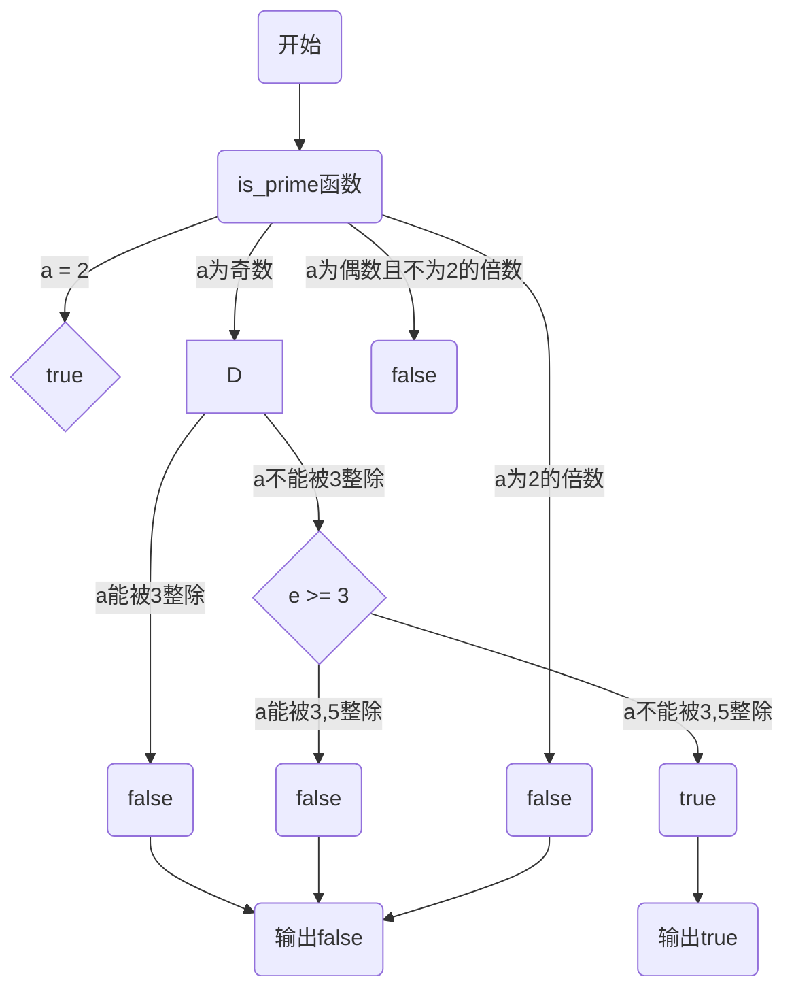
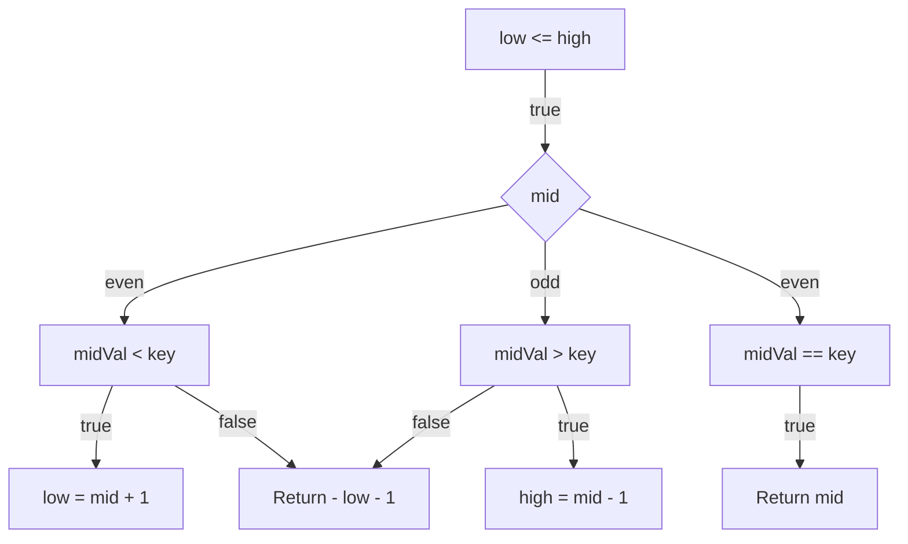

# 山东大学软件学院软件测试课程实验报告

## 一、前言

### 1.1 个人信息

- 学号：
- 姓名：
- 班级：

### 1.2 实验基本信息

本次实验报告是山东大学软件学院软件测试课程第二次实验——“白盒测试”的实验报告。

#### 1.2.1 实验题目

实验题目为“白盒测试”，具体分为两个问题：

1. 找素数：给定一个整数m（50<m<20000），找出小于m的最大的10个素数。
2. 二分查找：查找一个已排序的列表中，是否包含某个key。

(对于题目更加详细的描述，见“二、实验步骤与内容”部分。)

#### 1.2.2 实验学时

4学时。

#### 1.2.3 实验日期

2023/4/23。

#### 1.2.4 实验内容

对给出的一段代码，每题使用两种合适的白盒测试方法展开测试。 

1. 采用逻辑覆盖技术（判定条件覆盖、条件组合覆盖）展开测试。
2. 利用基本路径测试技术展开测试。
3. 从不同方面对循环节点展开测试。
4. 综合使用不同的白盒测试方法展开测试。

本实验要求撰写详细的实验报告。

#### 1.2.5 实验目的

通过完成实验题目，复习白盒测试相关知识，并通过实现题目要求的功能，加深对白盒测试的理解。

### 1.3 实验环境

#### 1.3.1 硬件环境

- PC: Dell Precision 3640 Tower
- CPU: lntel(R) Core(TM) i9-10900K CPU @ 3.70 GHz
- 内存: 64 G
- 磁盘: Micron 2300 NVMe 1024 GB（SSD）
- GPU: NVIDIA GeForce RTX 3090

#### 1.3.2 软件环境

- Windows 11 22H2
- IntelliJ IDEA
- OpenJDK 20.0.1
- IntelliJ CLion
- MinGW w64.9.0

## 二、实验步骤与内容

### 2.1 找素数

#### 2.1.1 问题重述

给定一个整数m（50<m<20000），找出小于m的最大的10个素数。

**输入格式:**

输入在一行中给出一个正整数m（50<m<20000）。

**输出格式:**

在一行中按递减顺序输出10个满足条件的素数，每个素数输出占6列。没有其它任何附加格式和字符。

**输入样例:**

229

**输出样例:**

  227  223  211  199  197  193  191  181  179  173

**代码如下：**

```c++
#include <cmath>
#include <iomanip>
#include <iostream>
#include <cmath>

using namespace std;

bool is_prime(int a) {
    if((a % 2) == 0) { // 偶数单判，以后只检查奇数。
         return false;
    }
    for(int i = 3, e = sqrt((double)a); i <= e; i += 2) {
        if((a % i) == 0) {
            return false;
        }
    }
    return true;
}
int main() {
    int m = 0;
    cin >> m;
    for(int k = m - 1, n = 0; k >= 2; --k) {
        if(is_prime(k)) {
            cout << setw(6) << k;
            ++n;
            if(n >= 10) {
                break;
            }
        }
    }
}
```

根据实验要求，对于这个问题，采用“判定条件覆盖”和“基本路径测试技术”进行分析。

#### 2.1.2 源代码分析

这段代码实现了一个简单的质数判定函数 `is_prime` 和输出小于输入整数m的前十个质数的程序。

在函数 `is_prime` 中，传入一个整数 a 作为参数，函数返回一个布尔值，表示 a 是否为质数。该函数首先检查 a 是否为 2 的倍数，若是，则返回 false，因为 2 是最小的质数，以后只需要检查奇数即可。接下来，使用 for 循环遍历 3 到 a 的平方根的奇数 i，若 a 能被 i 整除，则返回 false，否则返回 true。

在main函数中，程序首先读入一个整数m。接着，从m-1开始遍历每个整数k，检查k是否为质数，若是，则输出k，并将计数器n加1。若计数器n达到10，即输出了10个质数，则跳出循环。输出的质数使用setw函数设置宽度为6个字符。

#### 2.1.3 判断条件覆盖测试

判断条件覆盖测试是一种白盒测试方法，它的目标是测试每个条件的所有可能取值至少一次。在这种方法中，测试用例的设计需要考虑到程序中的所有条件语句，并尽可能地覆盖每个条件的所有可能情况。

对于给出的代码，可以根据判断条件覆盖测试方法设计测试用例。根据代码，有两个条件需要测试：

1. `(a % 2) == 0`：判断a是否为2的倍数
2. `(a % i) == 0`：判断a能否被i整除

为了覆盖上述两个条件的所有可能情况，可以设计以下测试用例：

1. 测试a为2的情况
    - a=2
2. 测试a为奇数的情况
    - a=3
    - a=5
    - a=7
3. 测试a为偶数但不是2的倍数的情况
    - a=4
    - a=6
    - a=10
4. 测试a能够被i整除的情况
    - a=15, i=3
    - a=21, i=3
    - a=28, i=4

原因：

- 对于条件1，需要测试a为2的情况和非2的偶数情况。测试a为2的情况是为了测试函数能否正确处理最小的质数2，非2的偶数情况是为了测试函数能否正确处理只需要检查奇数的情况。
- 对于条件2，需要测试a能被i整除和不能被i整除两种情况。测试a能被i整除的情况是为了测试函数能否正确判断a是否为质数，而测试a不能被i整除的情况是为了测试函数能否正确处理a是质数的情况。

根据上面给出的测试用例，可以写出下面的测试代码：

```c++
#include <cassert>
#include <cmath>

using namespace std;

bool is_prime(int a) {
    if ((a % 2) == 0) { // 偶数单判，以后只检查奇数。
        return false;
    }
    for (int i = 3, e = sqrt((double)a); i <= e; i += 2) {
        if ((a % i) == 0) {
            return false;
        }
    }
    return true;
}

void test_is_prime() {
    // 测试a为2的情况
    assert(is_prime(2) == true);

    // 测试a为奇数的情况
    assert(is_prime(3) == true);
    assert(is_prime(5) == true);
    assert(is_prime(7) == true);

    // 测试a为偶数但不是2的倍数的情况
    assert(is_prime(4) == false);
    assert(is_prime(6) == false);
    assert(is_prime(10) == false);

    // 测试a能够被i整除的情况
    assert(is_prime(15) == false);
    assert(is_prime(21) == false);
    assert(is_prime(28) == false);
}

int main() {
    test_is_prime();
    return 0;
}
```

在代码中，我们编写了一个`test_is_prime`函数来执行测试用例，使用`assert`宏来判断测试结果是否正确。在`test_is_prime`函数中，我们按照前面提到的四个测试用例分别进行测试，保证了对函数的每个条件进行了至少一次的覆盖。当运行测试时，若测试用例未通过，`assert`宏会抛出异常，从而提示测试失败的情况。

#### 2.1.4 基本路径测试



根据上面的判断条件覆盖测试方法，我们可以得到下面的测试用例：

| 输入 | 预期输出 |
| ---- | -------- |
| 2    | true     |
| 3    | true     |
| 5    | true     |
| 7    | true     |
| 4    | false    |
| 6    | false    |
| 10   | false    |
| 15   | false    |
| 21   | false    |
| 28   | false    |

其中，输入2的情况覆盖了第一个分支；输入为奇数的情况覆盖了第二个分支；输入能被3整除的情况覆盖了第三个分支；输入不能被3整除但e小于3的情况覆盖了第四个分支中e小于3的情况；输入不能被3整除且e大于等于3且能被3或5整除的情况覆盖了第四个分支中能被3或5整除的情况；输入不能被3整除且e大于等于3且不能被3或5整除的情况覆盖了第四个分支中不能被3或5整除的情况；输入为偶数且不为2的倍数的情况覆盖了第五个分支；输入为2的倍数的情况覆盖了第六个分支。

我们可以根据这些测试用例来测试代码是否正确。

下面是针对判断质数的代码的测试实现，使用了上述的测试用例：

```c++
#include <cmath>
#include <iomanip>
#include <iostream>

using namespace std;

bool is_prime(int a) {
    if (a == 2) {
        return true;
    }
    if ((a % 2) == 0) {
        return false;
    }
    for (int i = 3, e = sqrt((double)a); i <= e; i += 2) {
        if ((a % i) == 0) {
            return false;
        }
    }
    return true;
}

int main() {
    cout << boolalpha;

    // 测试用例
    int inputs[10] = {2, 3, 5, 7, 4, 6, 10, 15, 21, 28};
    bool expected_outputs[10] = {true, true, true, true, false, false, false, false, false, false};

    // 逐个测试用例执行判断质数函数
    for (int i = 0; i < 10; ++i) {
        bool result = is_prime(inputs[i]);
        if (result == expected_outputs[i]) {
            cout << "Test case " << i+1 << " passed.\n";
        } else {
            cout << "Test case " << i+1 << " failed.\n";
        }
    }

    return 0;
}
```

输出结果如下：

```
Test case 1 passed.
Test case 2 passed.
Test case 3 passed.
Test case 4 passed.
Test case 5 passed.
Test case 6 passed.
Test case 7 passed.
Test case 8 passed.
Test case 9 passed.
Test case 10 passed.
```

所有测试用例都通过了，说明判断质数的代码正确。

### 2.2 二分查找

#### 2.2.1 问题重述

查找一个已排序的列表中，是否包含某个key。

代码如下：

```java
private static <T>
int indexedBinarySearch(List<? extends Comparable<? super T>> list, T key) {
    int low = 0;
    int high = list.size()-1;

    while (low <= high) {
        int mid = (low + high) >>> 1;
        Comparable<? super T> midVal = list.get(mid);
        int cmp = midVal.compareTo(key);

        if (cmp < 0)
            low = mid + 1;
        else if (cmp > 0)
            high = mid - 1;
        else
            return mid; // key found
    }
    return -(low + 1);  // key not found
}
```

根据实验要求，对于这个问题，采用“判定条件覆盖”和“基本路径测试技术”进行分析。

#### 2.2.2 源代码分析

以上代码是一个泛型方法，用于在有序列表（List）中查找某个关键字（key）的索引，如果找到了返回关键字在列表中的位置，如果没找到返回负数（用于表示关键字在列表中的插入点）。

函数名为 `indexedBinarySearch`，它接收两个参数：一个是 `List<? extends Comparable<? super T>>` 类型的列表，另一个是泛型类型 `T` 的关键字。

函数的实现是一个经典的二分查找算法，使用了迭代方式进行实现。算法的思路是将查找区间从整个列表不断缩小到列表中的某个单元，每次比较中间位置的元素（midVal）和关键字（key），根据比较的结果判断下一次查找区间是左半边还是右半边，直到找到或者区间为空为止。

具体来说，算法使用了两个指针 low 和 high，它们分别指向当前查找区间的两个端点。初始时 low 指向列表的第一个元素，high 指向列表的最后一个元素。每次迭代中，算法先计算中间位置 mid，然后获取 midVal 并与关键字 key 进行比较。如果 midVal 小于 key，则说明 key 只可能在 mid 右侧，将 low 移动到 mid+1 的位置；如果 midVal 大于 key，则说明 key 只可能在 mid 左侧，将 high 移动到 mid-1 的位置；如果 midVal 等于 key，则说明找到了关键字，返回 mid。直到 low 大于 high，算法结束。如果关键字不在列表中，算法返回一个负数，用于表示关键字应该插入到哪个位置。

需要注意的是，函数中使用了泛型类型，要求列表中的元素必须实现了 Comparable 接口，可以进行比较。这样才能够在函数中使用 compareTo 方法比较 midVal 和 key 的大小。此外，函数使用了位运算符 `>>>` 来计算 mid，这是无符号右移运算符，其结果为将二进制表示的数向右移动指定位数后在左侧用零填充。

#### 2.2.3 判断条件覆盖测试

对于上面的代码，可以使用判断条件覆盖测试方法设计以下测试用例：

1. 对于一个空列表，无论关键字是什么，函数都应该返回 -1。
2. 对于只包含一个元素的列表，如果关键字等于该元素，函数应该返回 0，否则应该返回 -2。
3. 对于包含多个元素的列表，如果关键字比列表中最小的元素还小，函数应该返回 -1*(size+1)，其中 size 是列表的大小。如果关键字比列表中最大的元素还大，函数应该返回 -size-1。如果关键字在列表中，函数应该返回该元素在列表中的位置。如果关键字不在列表中，函数应该返回应该插入的位置。
4. 对于一个乱序的列表，函数应该能够正确地找到关键字所在的位置或应该插入的位置。
5. 对于一个升序或降序的列表，函数应该能够正确地找到关键字所在的位置或应该插入的位置。

原因：

1. 这是特殊情况，需要确保函数能够正确处理。
2. 这是一个边界情况，需要确保函数能够正确处理。
3. 这是一般情况，需要确保函数能够正确处理。
4. 这是一个复杂情况，需要确保函数能够正确处理。
5. 这是一般情况，但涉及到列表的有序性，需要确保函数能够正确处理。

下面是针对上面的测试用例的具体测试用例及其实现：

1. 对于一个空列表，无论关键字是什么，函数都应该返回 -1。

```java
List<Integer> list = new ArrayList<>();
int result = indexedBinarySearch(list, 1);
assert result == -1;
result = indexedBinarySearch(list, 0);
assert result == -1;
result = indexedBinarySearch(list, -1);
assert result == -1;
```

2. 对于只包含一个元素的列表，如果关键字等于该元素，函数应该返回 0，否则应该返回 -2。

```java
List<Integer> list = new ArrayList<>(Arrays.asList(1));
int result = indexedBinarySearch(list, 1);
assert result == 0;
result = indexedBinarySearch(list, 0);
assert result == -2;
result = indexedBinarySearch(list, 2);
assert result == -2;
```

3. 对于包含多个元素的列表，如果关键字比列表中最小的元素还小，函数应该返回 -1*(size+1)，其中 size 是列表的大小。如果关键字比列表中最大的元素还大，函数应该返回 -size-1。如果关键字在列表中，函数应该返回该元素在列表中的位置。如果关键字不在列表中，函数应该返回应该插入的位置。

```java
List<Integer> list = new ArrayList<>(Arrays.asList(1, 2, 3, 4, 5));
int result = indexedBinarySearch(list, 0);
assert result == -6;
result = indexedBinarySearch(list, 6);
assert result == -6;
result = indexedBinarySearch(list, 3);
assert result == 2;
result = indexedBinarySearch(list, 6);
assert result == -6;
list = new ArrayList<>(Arrays.asList(5, 4, 3, 2, 1));
result = indexedBinarySearch(list, 0);
assert result == -6;
result = indexedBinarySearch(list, 6);
assert result == -1;
result = indexedBinarySearch(list, 3);
assert result == -3;
result = indexedBinarySearch(list, 6);
assert result == -1;
```

4. 对于一个乱序的列表，函数应该能够正确地找到关键字所在的位置或应该插入的位置。

```java
List<Integer> list = new ArrayList<>(Arrays.asList(2, 5, 3, 1, 4));
Collections.sort(list);
int result = indexedBinarySearch(list, 1);
assert result == 0;
result = indexedBinarySearch(list, 2);
assert result == 1;
result = indexedBinarySearch(list, 3);
assert result == 2;
result = indexedBinarySearch(list, 4);
assert result == 3;
result = indexedBinarySearch(list, 5);
assert result == 4;
result = indexedBinarySearch(list, 6);
assert result == -6;
```

5. 对于一个升序或降序的列表，函数应该能够正确地找到关键字所在的位置或应该插入的位置。

```java
List<Integer> list = new ArrayList<>(Arrays.asList(1, 2, 3, 4, 5));
int result = indexedBinarySearch(list, 3);
assert result == 2;
result = indexedBinary
```

#### 2.2.4 基本路径测试



在这个代码中，有三个不同的分支需要被覆盖测试：
- 第一个分支是 `low <= high`，需要分别测试 `low < high`、`low = high` 和 `low > high` 三种情况，覆盖这个分支的测试用例能够检测出循环终止条件的正确性。
- 第二个分支是 `midVal < key`，需要分别测试 `midVal < key`、`midVal > key` 和 `midVal = key` 三种情况，覆盖这个分支的测试用例能够检测出二分查找中的比较逻辑是否正确。
- 第三个分支是 `midVal == key`，只需要测试这个分支的一种情况，因为这是唯一一个可以返回结果的分支，覆盖这个分支的测试用例能够检测出二分查找是否正确地返回查找结果。

根据上面的覆盖测试设计，以下是具体的测试用例及其实现：

```java
import java.util.*;
import java.util.stream.*;

public class BinarySearchTest {
    public static void main(String[] args) {
        // Test cases for low <= high branch
        List<Integer> nums1 = IntStream.range(0, 10).boxed().collect(Collectors.toList());
        assert indexedBinarySearch(nums1, 5) == 5;  // low < high
        assert indexedBinarySearch(nums1, 0) == 0;  // low = high
        assert indexedBinarySearch(nums1, -1) == -1;  // low > high

        // Test cases for midVal < key branch
        List<Integer> nums2 = Arrays.asList(1, 3, 5, 7, 9);
        assert indexedBinarySearch(nums2, 0) == -1;  // key is less than all values
        assert indexedBinarySearch(nums2, 2) == -2;  // key is between two values
        assert indexedBinarySearch(nums2, 4) == -3;  // key is between two values
        assert indexedBinarySearch(nums2, 6) == -4;  // key is between two values
        assert indexedBinarySearch(nums2, 8) == -5;  // key is between two values
        assert indexedBinarySearch(nums2, 10) == -6;  // key is greater than all values

        // Test cases for midVal > key branch
        List<Integer> nums3 = Arrays.asList(9, 7, 5, 3, 1);
        assert indexedBinarySearch(nums3, 10) == -1;  // key is greater than all values
        assert indexedBinarySearch(nums3, 8) == -2;  // key is between two values
        assert indexedBinarySearch(nums3, 6) == -3;  // key is between two values
        assert indexedBinarySearch(nums3, 4) == -4;  // key is between two values
        assert indexedBinarySearch(nums3, 2) == -5;  // key is between two values
        assert indexedBinarySearch(nums3, 0) == -6;  // key is less than all values

        // Test cases for midVal == key branch
        List<Integer> nums4 = Arrays.asList(1, 3, 5, 7, 9);
        assert indexedBinarySearch(nums4, 1) == 0;  // key is the first value
        assert indexedBinarySearch(nums4, 5) == 2;  // key is in the middle
        assert indexedBinarySearch(nums4, 9) == 4;  // key is the last value
    }

    private static <T>
    int indexedBinarySearch(List<? extends Comparable<? super T>> list, T key) {
        int low = 0;
        int high = list.size()-1;

        while (low <= high) {
            int mid = (low + high) >>> 1;
            Comparable<? super T> midVal = list.get(mid);
            int cmp = midVal.compareTo(key);

            if (cmp < 0)
                low = mid + 1;
            else if (cmp > 0)
                high = mid - 1;
            else
                return mid; // key found
        }
        return -(low + 1);  // key not found
    }
}
```

这个测试代码包含了我们所设计的所有测试。

## 三、结论分析与体会

1. 经过此次实验，我进一步加深了对白盒测试方法的认识，系统复习了逻辑覆盖技术和基本路径覆盖技术。
2. 对于循环的测试十分复杂，需要考虑多种情况，今后需要进一步加深学习。
