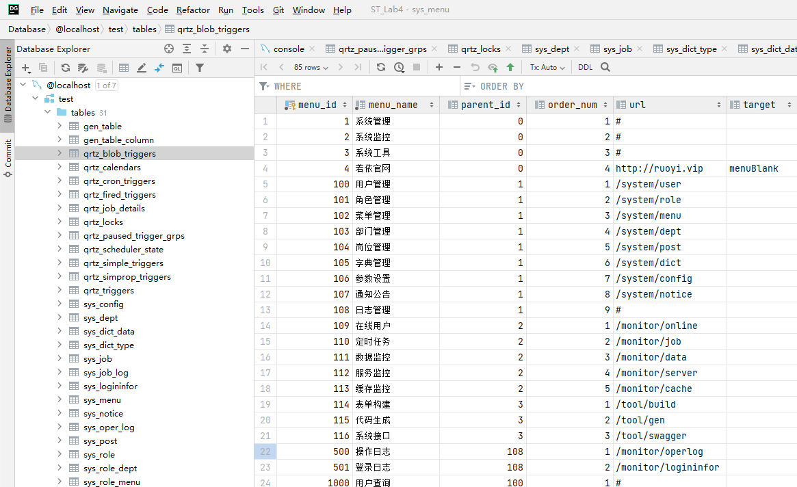
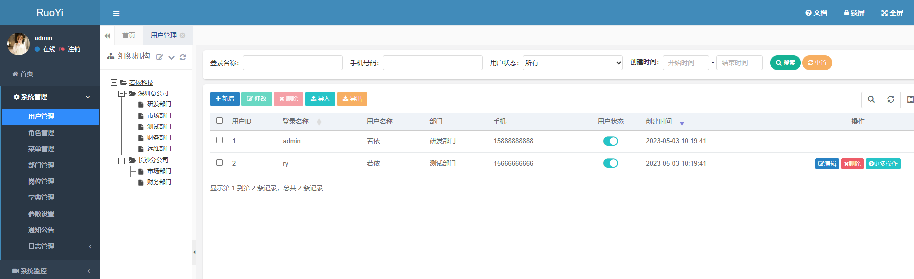
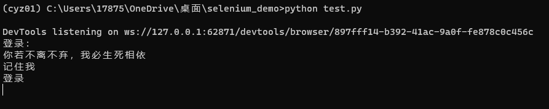
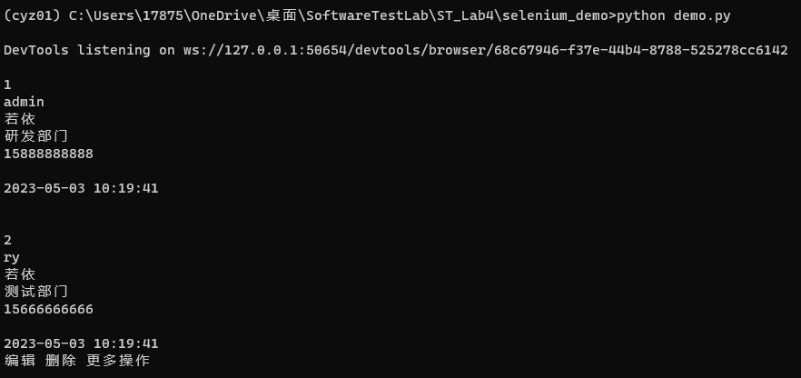
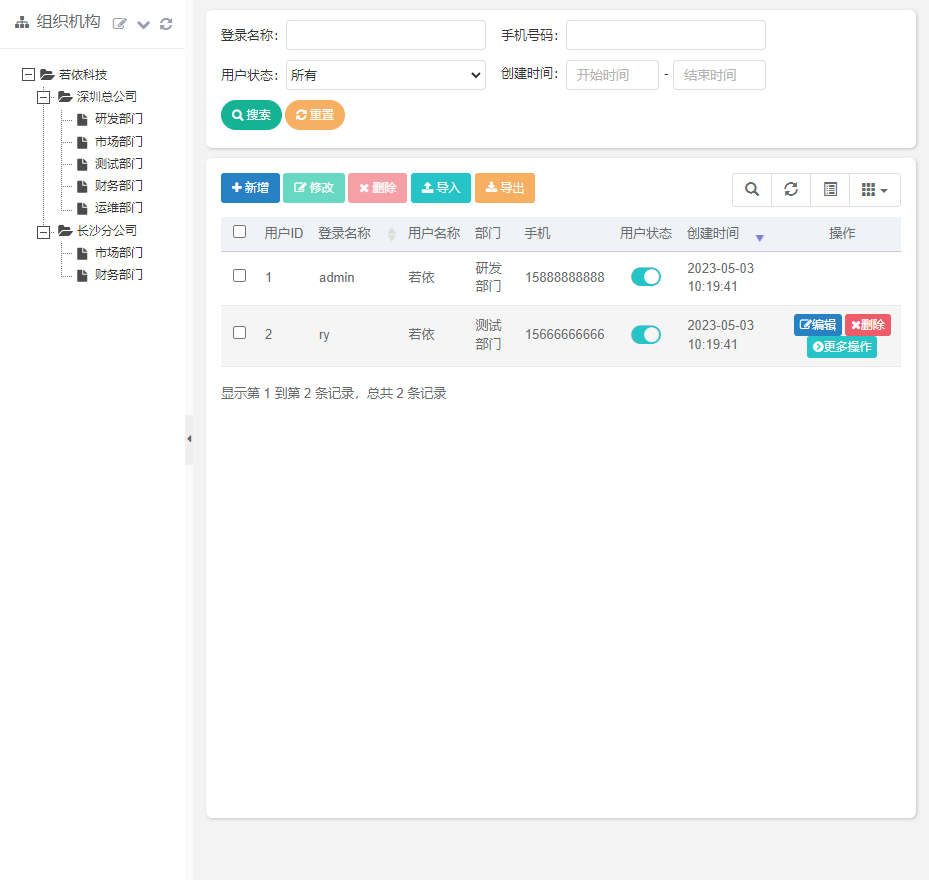

# 山东大学软件学院软件测试课程实验报告

## 一、前言

### 1.1 个人信息

- 学号：
- 姓名：
- 班级：

### 1.2 实验基本信息

本次实验报告是山东大学软件学院软件测试课程第四次实验——“Selenium 自动化测试”的实验报告。

本次实验代码已开源至 GitHub，链接为：https://github.com/cyz020403/Software-Testing-Lab。

#### 1.2.1 实验学时

4学时。

#### 1.2.2 实验日期

2023/4/28。

#### 1.2.3 实验内容

搭建附件的运行环境，并使用 Intellij IDEA 运行附件中的项目，实现编写 Selenium 自动化测试代码实现模拟登录并爬取用户列表信息。

本实验要求提交代码和实验过程的视频录制。

#### 1.2.4 实验目的

通过完成实验题目，学习和掌握自动化测试相关知识。

### 1.3 实验环境

#### 1.3.1 硬件环境

- PC: Dell Precision 3640 Tower
- CPU: lntel(R) Core(TM) i9-10900K CPU @ 3.70 GHz
- 内存: 64 G
- 磁盘: Micron 2300 NVMe 1024 GB（SSD）
- GPU: NVIDIA GeForce RTX 3090

#### 1.3.2 软件环境

- Windows 11 22H2
- IntelliJ IDEA
- OpenJDK 1.8
- Anaconda 管理的 python 3.7

## 二、实验步骤与内容

### 2.1 环境搭建与项目运行

#### 2.1.1 步骤

1. 安装 MySQL。
2. 使用数据库可视化软件 DataGrip。
3. 导入 quartz.sql 和 ry_20230223.sql 文件，初始化数据库。
4. 修改项目文件 application-druid.yml 中的数据库地址以及数据库用户名、密码的信息。
5. 运行 ruoyi 项目。
6. 输入地址 http://127.0.0.1:9999。
7. 输入用户名和密码 admin/admin123 登录系统。
8. 查看需要爬取的“用户列表信息”。

#### 2.1.2 可视化成果

DataGrip 可视化结果：



“用户列表信息””前端展示：



### 2.2 安装运行 Selenium

#### 2.2.1 安装及配置步骤

1. 安装Selenium
需要在Python环境中安装Selenium库。使用pip包管理器执行以下命令安装：

```shell
pip install selenium
```

2. 安装浏览器驱动程序
    Selenium需要一个浏览器驱动程序来与浏览器进行通信。你需要下载并安装适用于你所使用的浏览器的驱动程序。

  此处使用 ChromeDriver 113.0.5672.63。为当前已发布最新 ChromeDriver  版本。

3. 导入Selenium库
    在你的Python代码中导入Selenium库：

```python
from selenium import webdriver
from selenium.webdriver.chrome.service import Service
```

4. 创建一个浏览器实例
使用Selenium创建一个浏览器实例，并打开需要爬取的网站：

```python
# 指定浏览器驱动程序的路径
service = Service('C:\chromedriver.exe')
driver = webdriver.Chrome(service=service)

# 网页地址
# http://127.0.0.1:9999/login
driver.get('http://127.0.0.1:9999/login')
```

5. 使用Selenium进行数据抓取
使用 Selenium find_element 方法获取静态页面的数据信息。

```python
elem = driver.find_element('id', 'signupForm')
text = elem.text
print(text)
```

6. 关闭浏览器实例
完成数据抓取后，关闭浏览器实例：

```python
driver.quit()
```

#### 2.2.2 爬取的登录页面信息展示



### 2.3 使用 Selenium 爬取若依系统用户数据

#### 2.3.1 实现思路

实现的基本思想为：使用Selenium库控制Chrome浏览器访问一个网站，自动填写表单进行登录，然后在页面中查找特定表格元素，遍历该表格的所有行和单元格，最后打印每个单元格的文本内容。

具体实现思路如下：

1. 导入需要使用的模块：webdriver、Service、time和By。
2. 指定浏览器驱动程序的路径，并使用webdriver启动Chrome浏览器。
3. 使用driver.get()方法访问网站地址 http://127.0.0.1:9999/login。
4. 使用driver.find_element()方法找到登录页面的用户名和密码输入框，并使用send_keys()方法自动填写相应的用户名和密码。
5. 使用driver.find_element()方法找到登录按钮，并使用click()方法模拟用户点击登录按钮。
6. 使用time.sleep()方法等待1秒钟，确保登录成功后页面已经加载完毕。
7. 使用driver.get()方法访问目标页面 http://127.0.0.1:9999/system/user。
8. 使用time.sleep()方法等待1秒钟，确保目标页面已经加载完毕。
9. 使用driver.save_screenshot() 方法保存当前页面的屏幕截图，保存为itcast.png文件。
10. 使用driver.find_element() 方法找到具有特定ID的表格元素，这里使用了id属性值为bootstrap-table的表格。
11. 使用table.find_elements() 方法找到表格中的所有行，使用了By.TAG_NAME来定位行元素，标签名为tr。
12. 遍历每一行，并使用row.find_elements()方法找到行中的所有单元格，这里同样使用By.TAG_NAME来定位单元格元素，标签名为td。
13. 遍历每一个单元格，并使用print()函数打印出单元格中的文本内容。
14. 使用driver.quit()方法关闭浏览器并退出WebDriver会话。

#### 2.3.2 代码实现

```python
from selenium import webdriver
from selenium.webdriver.chrome.service import Service
import time
from selenium.webdriver.common.by import By

# 指定浏览器驱动程序的路径
service = Service('C:\chromedriver.exe')
driver = webdriver.Chrome(service=service)

# 网页地址
# http://127.0.0.1:9999/login
driver.get('http://127.0.0.1:9999/login')

# elem = driver.find_element('id', 'signupForm')
# text = elem.text
# print(text)

username_input = driver.find_element('name', 'username')
username_input.send_keys('admin')

password_input = driver.find_element('name', 'password')
password_input.send_keys('admin123')

login_button = driver.find_element('id', 'btnSubmit')
login_button.click()

time.sleep(1)

driver.get('http://127.0.0.1:9999/system/user')

# sleep 3 seconds
time.sleep(1)

driver.save_screenshot("itcast.png")

# 找到具有特定ID的表格元素
# table = driver.find_element_by_id("table-id")
table = driver.find_element("id", "bootstrap-table")

# 找到表格中的所有行
rows = table.find_elements(By.TAG_NAME, "tr")

# 遍历每一行，并找到行中的所有单元格
for row in rows:
    cells = row.find_elements(By.TAG_NAME, "td")
    
    # 遍历每一个单元格，并打印单元格中的文本
    for cell in cells:
        print(cell.text)

driver.quit()
```

#### 2.3.3 运行结果

获取的用户数据为：



Selenium 完成的截图结果：



## 三、结论分析与体会

1. 在此次实验中，我学习了基于 Python 的 Selenium 自动化测试工具的初步使用。
2. Selenium 是一款完善的自动化测试工具，由于其在网页交互方面的优越性，现也常用于网络爬虫。
3. 通过这次实验，我进一步了解和学习的自动化测试相关的知识，收获颇丰。
